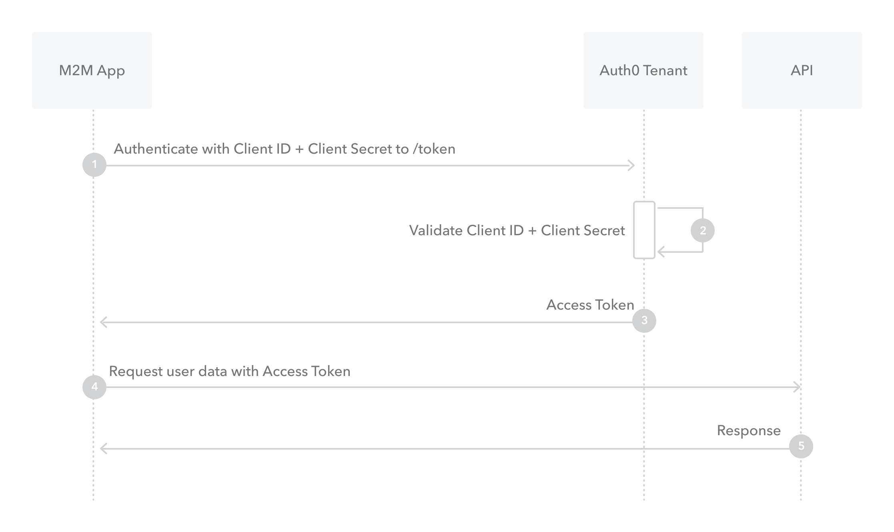

# OAuth 2 详解（四）：Client Credentials Flow

这种模式，是另外一种简单的授权模式，甚至连用户名密码都不需要，直接根据 `client_id`, `client_secret` 就可以授权。

步骤：

1. 应用携带 `client_id`, `client_secret` 请求 `Authorization Server`
2. `Authorization Server` 校验 `client_id`, `client_secret`
3. `Authorization Server` 下发 `access_token`，以及 `expires_in`等
4. App带着access token请求接口
5. 接口确认access token有效，返回对应数据

简单吧，这种模式适合什么情况呢？越简单的授权模式，要求对双方的信任度越高。这种模式，通常被用于M2M授权，M2M就是
Machine to Machine，比如 cli 请求服务器，服务间调用，这种模式更适合用于机器之间的授权，而不适用于用户。

---

ref:

- https://www.rfc-editor.org/rfc/rfc6749#section-4.4
- https://auth0.com/docs/get-started/authentication-and-authorization-flow/client-credentials-flow
- https://learn.microsoft.com/en-us/azure/active-directory/develop/v2-oauth2-client-creds-grant-flow
