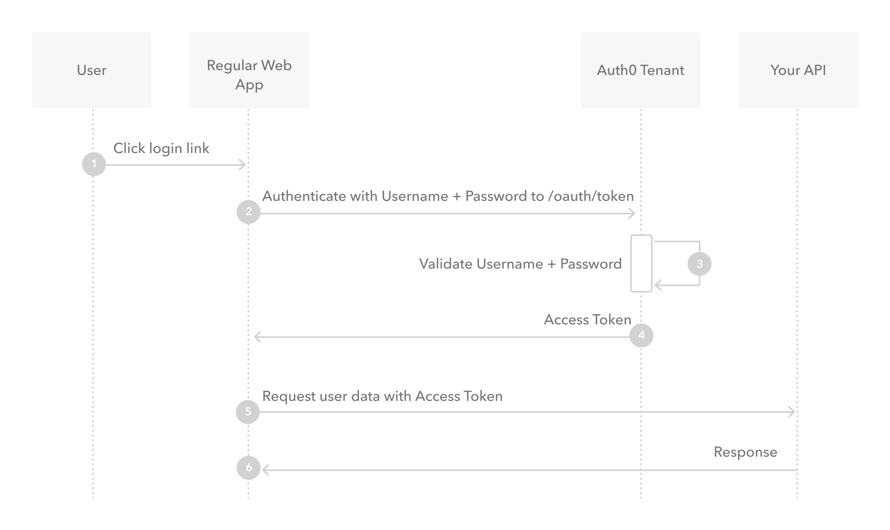

# OAuth 2 详解（三）：Resource Owner Password Credentials Grant

这大概是最简单的一种授权方式之一了，那就是用户名密码授权。通常来说，是不建议使用，但是有一种情况下，非常适合：那就是
自家App对接的时候，这样就可以复用已有的授权逻辑。这种模式，通常只适合用在可信度非常高的App里，一般也就是自家的App。

## 流程

```
+----------+
| Resource |
|  Owner   |
|          |
+----------+
    v
    |    Resource Owner
    (A) Password Credentials
    |
    v
+---------+                                  +---------------+
|         |>--(B)---- Resource Owner ------->|               |
|         |         Password Credentials     | Authorization |
| Client  |                                  |     Server    |
|         |<--(C)---- Access Token ---------<|               |
|         |    (w/ Optional Refresh Token)   |               |
+---------+                                  +---------------+
```



步骤如下：

1. 用户点击登录，应用弹出输入用户名密码界面
2. 应用带上用户名密码请求Authorization Server，还要携带 `client_id`, `client_secret`, `scope`, `grant_type` 设置为 `password`
3. Authorization Server 校验用户名密码
4. 校验通过，下发access token，以及 `refresh_token`, `expires_in` 等字段
5. App带着access token请求接口
6. 接口确认access token有效，返回对应数据

这一种授权模式比较简单，如果是对于第三方授权，那么是不建议使用这种模式的，对于自家App来说，使用这种方式可以复用已有逻辑。

---

refs:

- https://www.rfc-editor.org/rfc/rfc6749#section-4.3
- https://auth0.com/docs/get-started/authentication-and-authorization-flow/resource-owner-password-flow
- https://auth0.com/docs/get-started/authentication-and-authorization-flow/call-your-api-using-resource-owner-password-flow#prerequisites
- https://learn.microsoft.com/en-us/azure/active-directory/develop/v2-oauth-ropc
