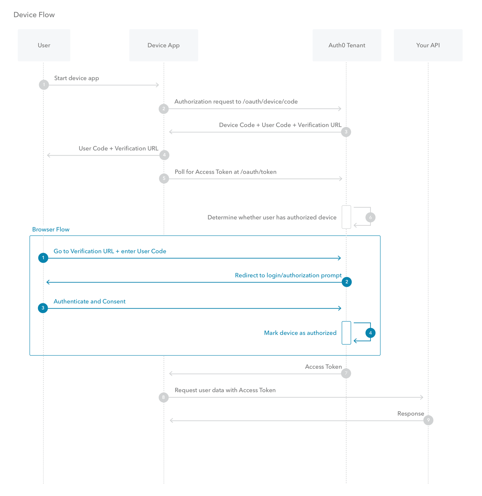

# OAuth 2 详解（五）：Device Authorization Flow

我们经常可以看到这样的需求：智能电视要我们登录帐号，或者是命令行程序，需要登录帐号。提示通常都是：扫码或者打开网页
并且输入验证码后登录。这就是device authorization flow的流程了。

这个授权流程，定义在 [RFC8628](https://www.rfc-editor.org/rfc/rfc8628)，我们来看看流程：

1. 首先用户启动应用
2. 应用携带 `client_id`, `scope` 请求 Authorization Server 的 `/oauth/device/code` 接口获取登录URL
3. Authorization Server 返回 `device_code`, `user_code`, `verification_url`, `verification_uri_complete`, `expires_in`, `interval`
4. 用户打开URL或者扫码访问，并且授权
5. 应用按照服务器返回的轮询间隔，开始轮询 Authorization Server
6. Authorization Server 判断用户是否已经同意授权
7. 如果用户同意授权，则返回 `access_token`
8. 应用使用 `access_token` 访问资源
9. 服务器判断 `access_token` 是否有效，如果有效，返回对应资源

## 应用场景

在什么地方会看到这种登录协议的使用场景呢？讲几个我看到的：

1. 智能电视要求登录，用这种协议就很方便，把 `verification_uri_complete` 的内容展示在二维码中，用户扫码后，批准授权即可登录
2. heroku cli 是这种流程
3. aws cli 开启SSO登录之后，也是这种流程

其它的类似场景，也都可以使用这种流程来完成授权。

---

refs:

- https://www.rfc-editor.org/rfc/rfc8628
- https://auth0.com/docs/get-started/authentication-and-authorization-flow/device-authorization-flow
- https://learn.microsoft.com/en-us/azure/active-directory/develop/v2-oauth2-device-code
