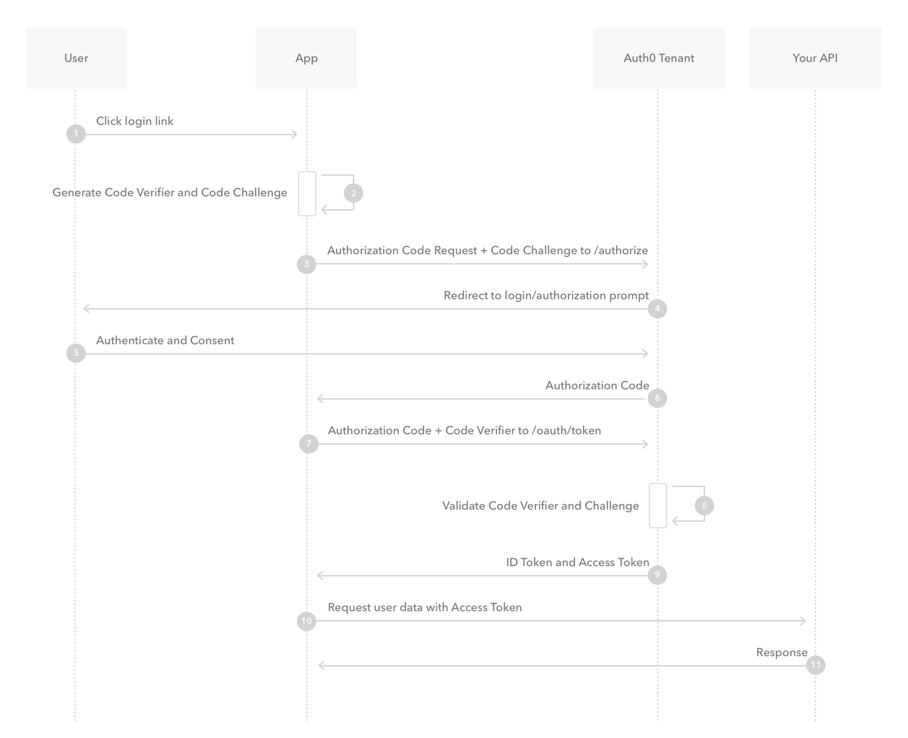

# OAuth 2 详解（六）：Authorization Code Flow with PKCE

我们在前面了解到，`Authorization Code` 模式是最安全的一种模式，但是必须要有服务端参与进来，因为 `client_secret` 必须保存在
服务端才安全。OAuth 2.0 在 [RFC7636](https://www.rfc-editor.org/rfc/rfc7636) 中定义了一种扩展模式，这种模式下，客户端
不需要使用 `client_secret`，模式中 PKCE 的全称是 Proof Key for Code Exchange。那怎么理解这个呢？简单来说，就是我们仍然
使用 Authorization Code 模式的流程，但是原来是需要服务端参与保存 `client_secret`，现在改成客户端临时生成一对密钥。

1. 用户点击登录按钮
2. 应用生成 `code_verifier`，是一个随机值，然后对 `code_verifier` 做sha256，得到哈希值 `code_challenge`
3. 应用携带 `client_id`, `code_challenge` 请求 Authorization Server
4. Authorization Server 提示用户是否授权
5. 用户点击同意授权
6. Authorization Server 生成 `code`，同时保存 `code_challenge`
7. 应用使用 `code` 和 `code_verifier` 请求 Authorization Server
8. Authorization Server 对 `code_verifier` 做sha256，得到哈希值，与 `code_challenge` 对比
9. 对比成功，下发 `access_token`
10. 应用请求资源
11. `access_token` 校验通过，返回响应

## 为什么这样可以保证安全性？

首先临时生成一个 `code_verifier`，保存在本地，然后将 `code_challenge` 发给服务端，服务端进行保存，然后换取 `access_token`
时，再将 `code_verifier` 提交上去，如果黑客获取了 `code_challenge`，他也无法进行下一步操作，如果黑客获取了 `code_verifier`，
他虽然可以获得 `access_token`，但是无法使用 `code_verifier` 再次获取，因为 `code_verifier` 和 `code_challenge` 是一对临时
生成的随机密钥（准确来说是一个随机值和随机值的哈希值）。

如果是客户端直接保存了 `client_secret` 那就不一样了，黑客获取之后，总是可以通过 `client_secret` 和 `code` 来换取 `access_token`。
这就是这种模式的安全所在。

## 总结

这就是我们看到的第六种OAuth授权模式，整个系列也就到此结束了。希望对读者有所帮助。

---

refs:

- https://www.rfc-editor.org/rfc/rfc7636
- https://auth0.com/docs/get-started/authentication-and-authorization-flow/authorization-code-flow-with-proof-key-for-code-exchange-pkce
