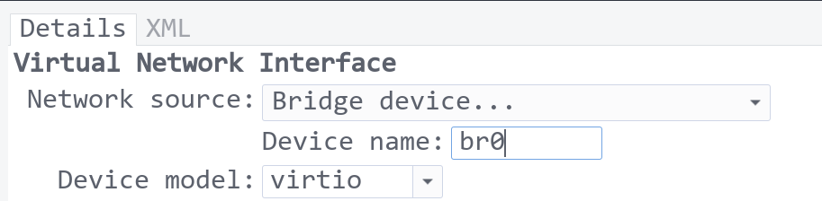

# 搭建旁路由

有一台机器处于这样的环境：有DNS污染、无法访问外网，而经常又需要下载一些依赖需要外网。但是这是一台老机器，没有多个
网口，因此无法网卡穿透做OpenWRT。那怎么办呢？这个时候，旁路由就可以登场了。

正常情况下，我们手机访问网络，都是这样的链路：

```
手机 <-> 路由器 <-> ISP(宽带运营商) <-> 网站
```

加了旁路由以后，会变成这样：

```
          <----------------------> ISP(宽带运营商) <-> 网站
          |
手机 -> 路由器 -> 旁路由 -
          ^              |
          |-------------->
```

也就是说，每次流量经过路由器，路由器都会转发给旁路由，然后旁路由再告诉路由器怎么走。这就要求：

1. 旁路由有一定的数据处理能力：我是直接搭建一台虚拟机，分配4核
2. 旁路由本身有一个IP：默认情况下，虚拟机都是处于宿主机的一个NAT网络下

1很好解决，加硬件即可。对于2，有两种解决办法：网络桥接(bridge)，增加物理网卡。

## 网络桥接(bridge)

这种方法，需要物理网卡支持，一般来说，有线网卡都是支持的，无线网卡就比较难说了。在Linux中，创建网桥的步骤为：

1. 断开当前网络
2. 创建网桥
3. 将物理网卡设置为网桥的slave
4. 将虚拟机连接到网桥

命令如下：

```bash
$ nmcli connection down Wired # 断开当前网络
$ nmcli con add type bridge ifname br0  # 增加网桥
$ nmcli con add type bridge-slave ifname eno1 master br0  # 将物理网卡设置为网桥的slave
$ nmcli conn up br0  # 启动网桥
```

然后就是打开 virt-manager ，将网络改为桥接到网桥。



但是我试过的结果是，启动虚拟机以后，总是要等上1分钟左右，才能连接到网络，控制变量法尝试找过原因，但是都没有找到。
因此，我选择了第二种方法。

## 增加物理网卡

鉴于桥接网络在我的机器上不太好用，所以我直接用一个USB千兆网卡插到宿主机上，然后 `virt-manager` 中选择添加USB设备，把
USB网卡穿透给虚拟机进行使用。

## 设置旁路由

通过上面的设置，虚拟机就可以拿到一个和宿主机一个网段的IP地址了。接下来，我们要做的就是搭建路由系统。我虚拟机里安装的
是Debian。

1. 下载 clash
2. 设置 systemd 启动文件
3. 配置 clash 规则

下载clash，保存至 `/usr/local/bin/clash`，给予运行权限。新建用户组：

```bash
$ useradd -M -s /usr/sbin/nologin clash
$ sudo mkdir -p /etc/clash/
```

配置好规则：

1. `/etc/clash/iptables.sh` 文件，设置各种 iptables 规则。

```bash
#!/usr/bin/env bash

set -ex

# ENABLE ipv4 forward
sysctl -w net.ipv4.ip_forward=1

# ROUTE RULES
ip rule add fwmark 666 lookup 666
ip route add local 0.0.0.0/0 dev lo table 666

# clash 链负责处理转发流量 
iptables -t mangle -N clash

# 目标地址为局域网或保留地址的流量跳过处理
# 保留地址参考: https://zh.wikipedia.org/wiki/%E5%B7%B2%E5%88%86%E9%85%8D%E7%9A%84/8_IPv4%E5%9C%B0%E5%9D%80%E5%9D%97%E5%88%97%E8%A1%A8
iptables -t mangle -A clash -d 0.0.0.0/8 -j RETURN
iptables -t mangle -A clash -d 127.0.0.0/8 -j RETURN
iptables -t mangle -A clash -d 10.0.0.0/8 -j RETURN
iptables -t mangle -A clash -d 172.16.0.0/12 -j RETURN
iptables -t mangle -A clash -d 192.168.0.0/16 -j RETURN
iptables -t mangle -A clash -d 169.254.0.0/16 -j RETURN

iptables -t mangle -A clash -d 224.0.0.0/4 -j RETURN
iptables -t mangle -A clash -d 240.0.0.0/4 -j RETURN

# 其他所有流量转向到 7893 端口，并打上 mark
iptables -t mangle -A clash -p tcp -j TPROXY --on-port 7893 --tproxy-mark 666
iptables -t mangle -A clash -p udp -j TPROXY --on-port 7893 --tproxy-mark 666

# 转发所有 DNS 查询到 1053 端口
# 此操作会导致所有 DNS 请求全部返回虚假 IP(fake ip 198.18.0.1/16)
# iptables -t nat -I PREROUTING -p udp --dport 53 -j REDIRECT --to 1053

# 如果想要 dig 等命令可用, 可以只处理 DNS SERVER 设置为当前内网的 DNS 请求
#iptables -t nat -I PREROUTING -p udp --dport 53 -d 192.168.0.0/16 -j REDIRECT --to 1053

# 最后让所有流量通过 clash 链进行处理
iptables -t mangle -A PREROUTING -j clash

# clash_local 链负责处理网关本身发出的流量
iptables -t mangle -N clash_local

# nerdctl 容器流量重新路由
#iptables -t mangle -A clash_local -i nerdctl2 -p udp -j MARK --set-mark 666
#iptables -t mangle -A clash_local -i nerdctl2 -p tcp -j MARK --set-mark 666

# 跳过内网流量
iptables -t mangle -A clash_local -d 0.0.0.0/8 -j RETURN
iptables -t mangle -A clash_local -d 127.0.0.0/8 -j RETURN
iptables -t mangle -A clash_local -d 10.0.0.0/8 -j RETURN
iptables -t mangle -A clash_local -d 172.16.0.0/12 -j RETURN
iptables -t mangle -A clash_local -d 192.168.0.0/16 -j RETURN
iptables -t mangle -A clash_local -d 169.254.0.0/16 -j RETURN

iptables -t mangle -A clash_local -d 224.0.0.0/4 -j RETURN
iptables -t mangle -A clash_local -d 240.0.0.0/4 -j RETURN

# 为本机发出的流量打 mark
iptables -t mangle -A clash_local -p tcp -j MARK --set-mark 666
iptables -t mangle -A clash_local -p udp -j MARK --set-mark 666

# 跳过 clash 程序本身发出的流量, 防止死循环(clash 程序需要使用 "clash" 用户启动) 
iptables -t mangle -A OUTPUT -p tcp -m owner --uid-owner clash -j RETURN
iptables -t mangle -A OUTPUT -p udp -m owner --uid-owner clash -j RETURN

# 让本机发出的流量跳转到 clash_local
# clash_local 链会为本机流量打 mark, 打过 mark 的流量会重新回到 PREROUTING 上
iptables -t mangle -A OUTPUT -j clash_local

# 修复 ICMP(ping)
# 这并不能保证 ping 结果有效(clash 等不支持转发 ICMP), 只是让它有返回结果而已
# --to-destination 设置为一个可达的地址即可
sysctl -w net.ipv4.conf.all.route_localnet=1
iptables -t nat -A PREROUTING -p icmp -d 198.18.0.0/16 -j DNAT --to-destination 127.0.0.1
```

这里需要根据自己的实际情况进行调整。例如我是直接让clash监听了53端口，所以不需要那个将53转发到1053的规则。

2. `/etc/clash/clean.sh` 清理iptables文件

```bash
#!/usr/bin/env bash

set -ex

ip rule del fwmark 666 table 666 || true
ip route del local 0.0.0.0/0 dev lo table 666 || true

iptables -t nat -F
iptables -t nat -X
iptables -t mangle -F
iptables -t mangle -X clash || true
iptables -t mangle -X clash_local || true
```

3. `/etc/clash/config.yaml` clash配置文件

这个就需要你本来就有，或者本来就知道怎么配置了。可以直接从官网抄一下：https://github.com/Dreamacro/clash/wiki/configuration#all-configuration-options

但是注意几点：

- `tproxy-port: 7893` 需要设置成和 `/etc/clash/iptables.sh` 中的一致
- `allow-lan: true` 要设置为 true
- `dns` 要打开

```yaml
# DNS server settings
# This section is optional. When not present, the DNS server will be disabled.
dns:
  enable: true
  listen: 0.0.0.0:53
  # ipv6: false # when the false, response to AAAA questions will be empty

  # These nameservers are used to resolve the DNS nameserver hostnames below.
  # Specify IP addresses only
  nameserver:
    - 'tls://dns.rubyfish.cn:853'
    - 'tls://1.1.1.1:853'
    - 'tcp://1.1.1.1'
    - 'tcp://208.67.222.222:443'
    - 'tls://dns.google'
  enhanced-mode: redir-host
  fake-ip-range: 198.18.0.1/16 # Fake IP addresses pool CIDR
```

还有一个 systemd service 文件 `/lib/systemd/system/clash.service`：

```bash
[Unit]
Description=Clash TProxy
After=network.target

[Service]
Type=simple
User=clash
Group=clash
CapabilityBoundingSet=CAP_NET_ADMIN CAP_NET_BIND_SERVICE CAP_NET_RAW
AmbientCapabilities=CAP_NET_ADMIN CAP_NET_BIND_SERVICE CAP_NET_RAW
Restart=on-failure

ExecStartPre=+/usr/bin/bash /etc/clash/clean.sh
ExecStart=/usr/local/bin/clash -d /etc/clash
ExecStartPost=+/usr/bin/bash /etc/clash/iptables.sh

ExecStopPost=+/usr/bin/bash /etc/clash/clean.sh

[Install]
WantedBy=multi-user.target
```

配置好以后，启动 clash:

```bash
$ sudo systemctl enable --now clash
```

到这里，你的路由器本身就可以提供DNS服务和代理了。

## 将虚拟机设置为默认网关和默认DNS服务器

在路由器中，将默认网关和DNS服务器，分别改为虚拟机的IP地址，另外，将虚拟机设置为分配一个固定IP(省得后面DHCP IP变化了
还要改配置)。

至此，重连设备，大功告成。

## 总结

这一篇文章记录了如何配置一个旁路由，比较适合的情况是物理网口不够用，无法直接搭建OpenWRT，而又需要访问外网，配置好以后，
效果其实和OpenWRT软路由一样。只是还需要在路由器里设置一下默认网关，如果路由器不支持更改，就需要在设备上自定义网关，相对
来说会麻烦一些。


---

ref:

- https://github.com/Dreamacro/clash/pull/1049
- https://mritd.com/2022/02/06/clash-tproxy/
