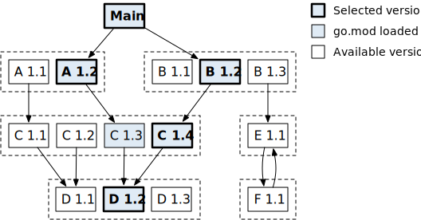

# Go mod 简明教程

最近认真学习了一下 `go mod`，整理成文。这篇文章是系统的了解 `go mod`，并不是简单介绍如何使用。

在 `go mod` 出来之前，社区采用的是类似 `NodeJS` 那种模式，`vendor`，也就是把所有的包都保存在 `vendor` 这个目录下，但是
这种方式显然不够优雅，后来有了 `go mod`，到今天为止，`go mod` 已然成为了Go社区模块管理的标准。

## 概念

- module。有 `go.mod` 的文件夹，就是一个 module。简单来说，一个module，里面包含了若干个package。
- package。一个文件夹下，若干个 `*.go` 文件组成一个包，每个 `.go` 文件顶部，都会有一个 `package xxx` 来声明自己是什么包。

## 版本

`module` 有版本，Go里遵守 [Semantic Versioning 2.0.0](https://semver.org/spec/v2.0.0.html)，因此，版本基本都会长这样：
`v0.0.1`, `v1.2.3`, `v2.0.0` 等等。通常从git仓库中读取的时候，就是以tag为准，有的仓库没有打tag，那么Go会自动生成一个
版本号，称之为 `pseudo-version`，也就是伪版本号，例如 `v0.0.0-20191109021931-daa7c04131f5`。大概的格式是：

- vX.0.0 基础版本
- 时间戳，格式为 yyyymmddhhmmss，时间值是该次提交的UTC时间
- 提交哈希值的前12位

上面三个，用 `-` 连起来。

### 大版本

也许我们的程序，会出现 `2.0`, `3.0`, `4.0`，那么，Go提供的方案是什么呢？答案是，建一个子目录，例如 `v2` 版本，就建立一个 `v2`
子目录，`v3` 就建 `v3` 子目录。或者如果在顶级目录的话，就要在 `go.mod` 声明的路径里最后加一个 `v2` 或者 `v3` 的后缀。

说实话，不是很优雅。他这个决定，主要是基于这么一条准则：

```
If an old package and a new package have the same import path, the new package
must be backwards compatible with the old package.
```

也就是说，同一个大版本号内的代码，必须是兼容的。Go这样做，带来的一个问题是，例如从 `v2` 升级到 `v3` 的时候，也许
的确有一些不兼容的地方，但是大部分代码都还是兼容的，又不是完全重写。而这样做了以后呢，调用者原本是导入
`github.com/x/aaa`，现在要全部改成导入 `github.com/x/aaa/v2`，并且以前所有引用到的地方都需要改。此外 `v2` 里的`aaa.XXXStruct`
和 `v1` 版本里的 `aaa.XXXStruct` 是不兼容的，无法互相赋值的，这样就会导致调用者需要改很多东西，带来不少负担。

## GOPROXY, GOPRIVATE 等常用环境变量

- 在国内，`go get` 基本上是无法直接使用的，原因你懂的。因此我们一般都要设置 `GOPROXY` 这个环境变量：

```bash
$ go env -w GOPROXY="https://goproxy.cn,direct"
```

- 如果你的项目是私有项目，那么你还需要把对应的路径加到 `GOPRIVATE` 这个变量里：

```bash
$ go env -w GOPRIVATE="github.com/your_name,git.example.com"
```

如果只有一个，就写一个，多个，就用逗号连起来。对于私有仓库，建议同时设置一个 `GONOSUMDB`，值和它一样。

## go.mod 文件

上面我们说了，有 `go.mod` 文件的地方，就是一个module。我们来看看 `go.mod` 的格式，先来看一个例子：

```go
module example.com/my/thing

go 1.12

require example.com/other/thing v1.0.2
require example.com/new/thing/v2 v2.3.4
exclude example.com/old/thing v1.2.3
replace example.com/bad/thing v1.4.5 => example.com/good/thing v1.4.5
retract [v1.9.0, v1.9.5]
```

- `module` 声明模块自身的路径
- `go` 声明这个模块所用的Go版本
- `require` 声明这个模块依赖的模块
- `exclude` 让go mod不要加载这个模块
- `replace` 声明替换，`=>` 前是代码中的路径，后是要替换成的路径
- `retract` 声明这个模块中，损坏的版本，或者要撤回，要大家别用的版本。作用是，设置了的版本，使用者碰到这个
版本的时候，就会看到对应的提示

里面所有的路径，都是 URL 加 空格，加 版本号的格式，例如 `example.com/new/thing/v2 v2.3.4`。

## 版本选择

go mod 是怎么做版本选择的呢？一句话：从当前项目 `main` 开始，构建一颗依赖树，当多个子模块依赖同一个模块时，选最新的。



如上图，`main` 依赖 `A1.2`, `B1.2`，`A1.2` 依赖 `C1.3`，而 `B1.2` 依赖 `C1.4`，他们同时依赖 `D1.2`。最后，`go mod`
会选择 `main`, `A1.2`, `B1.2`, `C1.4`, `D1.2`。

### 子目录

有的时候，我们想要给子目录打一个版本，那怎么做呢？答案是在版本号前面加上目录的路径就可以，例如：

```bash
module/
        - A
        - A/B
```

那我们执行 `git tag A/B/v0.1.2` 就可以。

## 常见命令

我们来看看常见的和版本控制有关系的命令：

- `go mod init github.com/xxx/yyy` 声明一个模块
- `go mod tidy` 执行模块选择，并且把选择的依赖写到 `go.sum` 文件里
- `go mod why` 解释引入某个依赖的依赖链
- `go build` 构建二进制
- `go get` 添加依赖
- `go get -u` 更新依赖

## 总结

这篇文章整理了 `go mod` 的基本概念，然后介绍了它的版本选择方案，以及常见的使用方法和命令，希望能够给读者带来帮助。

---

ref:

- https://go.dev/ref/mod
