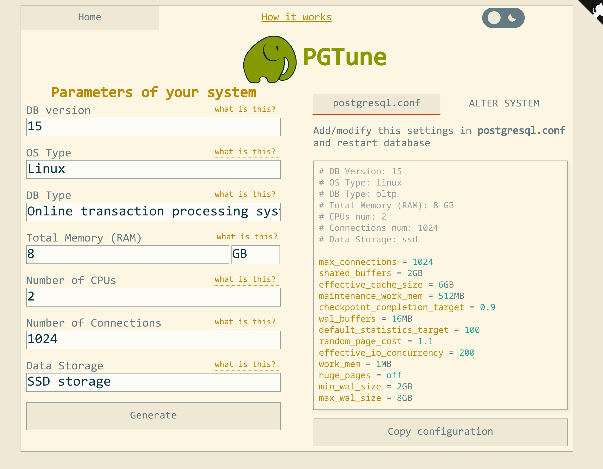

# PostgreSQL 配置优化和日志分析

## 性能

PG默认的配置下，连接数和缓存等都不是很大，因此我们需要根据机器的情况来优化参数，这里我推荐一个工具 [pgtune](https://pgtune.leopard.in.ua/) 。
它可以根据输入的机器性能，给你输出比较适合的配置，例如



我们只需要根据输出微调即可，解释一下这几个关键配置：

```bash
max_connections = 1024  # 最大连接数
shared_buffers = 2GB  # PG使用2GB内存来做缓存
effective_cache_size = 6GB  # 剩下的6GB内存，作为PG和操作系统一起用的缓存
maintenance_work_mem = 512MB  # PG执行一些维护工作时使用的内存大小，例如VACUUM，构建索引和ALTER TABLE等等
checkpoint_completion_target = 0.9  # 这个涉及到WAL日志的checkpoint操作，我还不是特别清楚
wal_buffers = 16MB  # WAL 日志的缓冲区大小
default_statistics_target = 100  # 收集统计信息的深度
random_page_cost = 1.1  # PG查询优化器认为读取一个随机页面的成本(具体我也不清楚，应该是影响PG做读取操作的)
effective_io_concurrency = 200  # 并发磁盘I/O操作的数量
work_mem = 1MB  # PG执行排序或者哈希表操作时可以使用的内存量
huge_pages = off  # 关闭huge page特性
min_wal_size = 2GB  # 最小的WAL大小
max_wal_size = 8GB  # 最大的WAL大小
```

除此之外，还需要更改一些日志相关的配置：

```bash
log_min_duration_statement = 500  # 超过这个时间的SQL就会被记录到慢日志，单位是ms
log_line_prefix = '%t [%p]: user=%u,db=%d,app=%a,client=%h '  # 更改日志格式
log_checkpoints = on  # 记录检查点
log_connections = on  # 记录打开连接的信息
log_disconnections = on  # 记录关闭连接的信息
log_lock_waits = on  # 记录等待锁的信息
log_temp_files = 0  # 记录临时文件的信息
log_autovacuum_min_duration = 0  # 记录删除无用文件的时间(VACUUM)
log_error_verbosity = default  # 记录错误的详细程度
lc_messages='en_US.UTF-8'
lc_messages='C'
```

然后重启一下数据库，应用这些配置：`sudo systemctl restart postgresql`

## 慢查询

有了上述日志相关的配置之后，接下来就是分析慢查询，有另外一个比较实用的工具：[pgbadger](https://github.com/darold/pgbadger)。
很多发行版都包含了这个程序，因此可以直接安装：

```bash
$ sudo apt install -y pgbadger
```

安装好之后，就可以开始分析了：

```bash
$ sudo su
# pgbadger /var/log/postgresql/postgresql-15-main.log
```

等待完成之后，当前目录就会产生一个 out.html 文件，打开就可以看到具体的分析，除此之外，我们还可以设置一个定时任务，例如
每天1点执行一次分析，分析所有的日志，并且以增量的形式分析：

```bash
# mkdir -p /var/www/html/pgbadger

# crontab -e  # 然后输入下面的这个定时任务
0 1 * * * pgbadger --R 1 -I -q /var/log/postgresql/postgresql-* -O /var/www/html/pgbadger/
```

这样每天1点就会执行一次，而且是以增量的形式执行分析，第二天就可以查看报告了。
