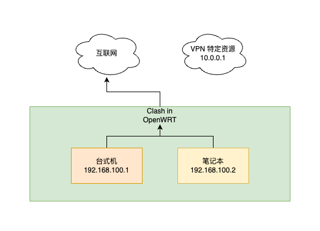
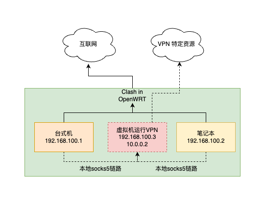

# Clash 结合 工作VPN 的网络设计

这个是我曾经探索实践过的方案，主要用于学习工作，但是看网络上有不少人有同样的疑惑，因此整理一下分享给大家。
Clash是一个网络分流工具，为了方便使用，我直接在 OpenWRT 也就是路由器这一层面搭建的Clash，因此只要在局域网内都可以获得流畅的网络。

> 请注意，本文没有写的特别详细，需要一定的网络基础功才能看懂。

但是有这么一种情况，就是有可能你公司的VPN，和clash的规则冲突，尤其是当你启用了clash的 fake-ip 功能以后。

解决方案的核心，其实就是使用 clash 规则中的 `SRC-IP-CIDR`，以及 `fake-ip-filter`。

首先我们看看出问题的网络架构：



每个公司的VPN都有自己的一套路由规则，有的是全局代理，有的是规则代理。Clash的原理，其实也是按照规则来路由流量，
这两者很有可能就会冲突，因此我的做法就是，划分一台独立的设备，这样就可以获得局域网内一个IP地址，然后设置为固定IP。
然后在 clash 上配置，从这个IP发出的流量，一律直连，这样就相当于在局域网的网络规则中开了一个特殊通道，让VPN能够正常连上
公司的服务器。

配置方法，就是在 `config.yml` 中，`rules` 下添加一条特殊规则：

> `config.yml` 是clash的配置文件

```yaml
rules:
- SRC-IP-CIDR,192.168.100.3/32,DIRECT
```

这样就实现了只要是从这台机器的流量，全都会直接打到 VPN server 上。但是如果你的工作VPN不是全局模式，而是规则代理模式，而
恰好你的clash使用的是 fake-ip 模式，那有可能有一些内部网站你仍然无法访问，因为 `fake-ip` 模式给了你一个假的解析出来的地址，
恰好这个IP地址没有命中VPN的路有规则，解决办法也很简单，就是在 `config.yml` 的 `fake-ip-filter` 中加入你的域名，例如：

```yaml
fake-ip-filter:
- '*.lan'
- '*.localdomain'
- '*.example'
```

公司 VPN 的网络问题解决了，那么你的笔记本或者台式机，要怎么访问呢？我的办法是在这台独立的机器上搭建 `socks5` 服务，
然后笔记本或者台式机使用 SwitchOmega/SmartProxy 等连接到 `socks5` 服务，从而使用VPN网络中的流量，网络拓扑如下：



搭建 socks5 服务，常见的就是又搞 ss/clash 等，但是我有一个更简单的办法：

```bash
$ ssh -D $port_number $username@$hostname
# 例如
$ ssh -D 1081 me@192.168.100.3
```

然后笔记本或者台式机直接使用 `127.0.0.1:1081` 的 socks5 代理即可临时使用VPN网络，其余时候就关闭 SwitchOmega/SmartProxy 使用直连网络，
或者不怕麻烦的话，配置一个规则，按域名走不同的代理即可。
