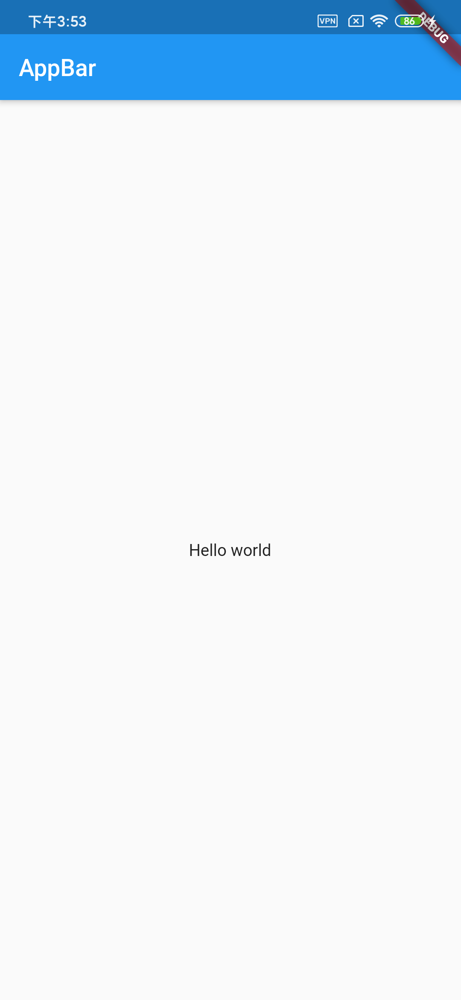

# Flutter组件(widget)库手册

Flutter的组建分为三种：

- `StatefulWidget`: 这种类型的组件会保存状态，比如，一个按钮按了几次，这个几次就是一个状态
- `StatelessWidget`: 这种类型的组件不会保存状态
- `InheritedWidget`: 这种类型的组件可以用来进行一些子代和祖先的操作，比如 `Theme.of()` 就是这样的操作

Flutter自带两套主题，一套是Google的Material，一套是Apple的Cupertino。我们以Material为主。

一个简单的Material的例子是这样的：

```dart
import 'package:flutter/material.dart';

void main() => runApp(MyApp());

class MyApp extends StatelessWidget {
  Widget build(BuildContext context) {
    return MaterialApp(
      title: "Flutter demo",
      home: Scaffold(
        appBar: AppBar(title: Text("AppBar")),
        body: Center(child: Text("Hello world")),
      ),
    );
  }
}
```

效果如下：



## 组件库

- `MaterialApp` 使用Material Design的App就用这个，我们来看看它的参数：

```dart
const MaterialApp({
    Key key,
    this.navigatorKey,
    this.home, // 默认情况下，home就是 '/' 路由
    this.routes = const <String, WidgetBuilder>{}, // 路由
    this.initialRoute,
    this.onGenerateRoute,
    this.onUnknownRoute,
    this.navigatorObservers = const <NavigatorObserver>[],
    this.builder,
    this.title = '',
    this.onGenerateTitle,
    this.color,
    this.theme,
    this.darkTheme,
    this.themeMode = ThemeMode.system,
    this.locale,
    this.localizationsDelegates,
    this.localeListResolutionCallback,
    this.localeResolutionCallback,
    this.supportedLocales = const <Locale>[Locale('en', 'US')],
    this.debugShowMaterialGrid = false,
    this.showPerformanceOverlay = false,
    this.checkerboardRasterCacheImages = false,
    this.checkerboardOffscreenLayers = false,
    this.showSemanticsDebugger = false,
    this.debugShowCheckedModeBanner = true,
})
```

    - For the / route, the home property, if non-null, is used.
    - Otherwise, the routes table is used, if it has an entry for the route.
    - Otherwise, onGenerateRoute is called, if provided. It should return a non-null value for any valid route not handled by home and routes.
    - Finally if all else fails onUnknownRoute is called.

- `Scaffold` 是一个UI的架子，一般我们会把它的实例放在 `MaterialApp` 的 `home` 上。

示例图：

我们来看看它的属性：

```dart
const Scaffold({
    Key key,
    this.appBar, // 标题
    this.body, // body就是我们要显示的其他的widget了
    this.floatingActionButton, // 右下角的浮动按钮
    this.floatingActionButtonLocation,
    this.floatingActionButtonAnimator,
    this.persistentFooterButtons,
    this.drawer,
    this.endDrawer,
    this.bottomNavigationBar,
    this.bottomSheet,
    this.backgroundColor,
    this.resizeToAvoidBottomPadding,
    this.resizeToAvoidBottomInset,
    this.primary = true,
    this.drawerDragStartBehavior = DragStartBehavior.start,
    this.extendBody = false,
    this.drawerScrimColor,
    this.drawerEdgeDragWidth,
})
```

- `AppBar` 是标题栏。上面可以放标题和一些图标，`title` 属性是标题。看看AppBar的主要属性：


```dart
AppBar({
    Key key,
    this.leading,
    this.automaticallyImplyLeading = true,
    this.title,
    this.actions,
    this.flexibleSpace,
    this.bottom,
    this.elevation,
    this.shape,
    this.backgroundColor,
    this.brightness,
    this.iconTheme,
    this.actionsIconTheme,
    this.textTheme,
    this.primary = true,
    this.centerTitle,
    this.titleSpacing = NavigationToolbar.kMiddleSpacing,
    this.toolbarOpacity = 1.0,
    this.bottomOpacity = 1.0,
})
```

- `Center` 把它的子组件放在中间。

- `Text` 是显示文字的组件，常见用法：`Text("Hello World")`，看看它的主要参数：

```dart
const Text(
    this.data, {
    Key key,
    this.style, // 样式
    this.strutStyle,
    this.textAlign,
    this.textDirection,
    this.locale,
    this.softWrap,
    this.overflow,
    this.textScaleFactor,
    this.maxLines,
    this.semanticsLabel,
    this.textWidthBasis,
})
```
