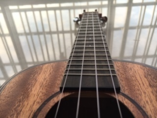

尤克里里
==========

算下来，入手尤克里里已经快要有2个月了。

从小到大都没有接触过音乐，因此想学一学，所以就买了一把相对简单而且精巧的23寸Tom
的尤克里里。从拿着书，一个一个手势慢慢弹，左手掐到肉都快陷进去，特别特别疼，
到现在能弹弹小情歌小幸运的一部分曲子，还是可以看到进步的。

从学习ukulele，让我更加相信，坚持的力量。有一位前辈说过，每天弹十分钟的效果，
远大于每周某一天弹一下午的效果。这点，我是相信的。

继续加油！
