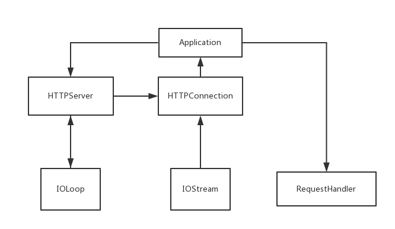

Tornado 源码阅读
==================

准备开始学习django的文档和源代码了，先总结一下看tornado源码的收获，防止忘记。
这里写的是tornadov1.2的代码，因为我看了一遍4.3版本，和1.2思路相差不大，只是
utils更多了，1.2版本代码量少，更有利于理清思路。列出我们将会涉及到的文件:

.. code:: bash

    # tree
    .
    ├── httpserver.py
    ├── httputil.py
    ├── __init__.py
    ├── ioloop.py
    ├── iostream.py
    ├── web.py

自上而下 - 总体概览
---------------------

首先，我们来一张图，表明tornado整体的框架，但是并不涉及tornado中所有文件和类，
只是其中一部分而已。

不太会画图，描述一下图片的意思吧：

- tornado是以IOLoop为核心的(虽然没有画在中间),
  `IOLoop <https://github.com/tornadoweb/tornado/blob/branch1.2/tornado/ioloop.py#L43>`__
  是对epoll, kqueue, select的一层包装，是异步的核心，相当于 python3.4 引入的
  `DefaultSelector <https://docs.python.org/3/library/selectors.html#selectors.DefaultSelector>`__

- `Application <https://github.com/tornadoweb/tornado/blob/branch1.2/tornado/web.py#L987>`__
  是整个web应用的配置中心，配置一些东西比如 `secret_cookie` 等，其中还包括了
  URL正则和对应的Handler 列表。

- HTTPServer 或者是 WSGI 负责解析HTTP请求

- HTTPConnection是一次处理的包装，在HTTPServer初始化的时候，会把Application的实例
  传到HTTPServer中，当请求来了，就调用application，从而执行 `__call__` 方法

.. code:: python

    def __call__(self, request):
        """Called by HTTPServer to execute the request."""
        transforms = [t(request) for t in self.transforms]
        handler = None
        args = []
        kwargs = {}
        handlers = self._get_host_handlers(request)
        if not handlers:
            handler = RedirectHandler(
                self, request, url="http://" + self.default_host + "/")
        else:
            for spec in handlers:
                match = spec.regex.match(request.path)
                if match:
                    # None-safe wrapper around urllib.unquote to handle
                    # unmatched optional groups correctly
                    def unquote(s):
                        if s is None: return s
                        return urllib.unquote(s)
                    handler = spec.handler_class(self, request, **spec.kwargs)
                    # Pass matched groups to the handler.  Since
                    # match.groups() includes both named and unnamed groups,
                    # we want to use either groups or groupdict but not both.
                    kwargs = dict((k, unquote(v))
                                  for (k, v) in match.groupdict().iteritems())
                    if kwargs:
                        args = []
                    else:
                        args = [unquote(s) for s in match.groups()]
                    break
            if not handler:
                handler = ErrorHandler(self, request, status_code=404)

        # In debug mode, re-compile templates and reload static files on every
        # request so you don't need to restart to see changes
        if self.settings.get("debug"):
            if getattr(RequestHandler, "_templates", None):
                for loader in RequestHandler._templates.values():
                    loader.reset()
            RequestHandler._static_hashes = {}

        handler._execute(transforms, *args, **kwargs)
        return handler

- IOStream是socket上的一层包装，也会传到HTTPConnection中。

从socket开始
-------------

好了，概览看完了，接下来我们从服务器socket开始过一遍。

.. code:: python

    application = web.Application([
        (r"/", MainPageHandler),
    ])
    http_server = httpserver.HTTPServer(application)
    http_server.listen(8080)
    ioloop.IOLoop.instance().start()

这里我们看到了，首先实例化Application，里边设置了路由表。

看看HTTPServer的demo:

.. code:: python

    import httpserver
    import ioloop
    def handle_request(request):
        message = "You requested %s\n" % request.uri
        request.write("HTTP/1.1 200 OK\r\nContent-Length: %d\r\n\r\n%s" % (
                        len(message), message))
        request.finish()
    http_server = httpserver.HTTPServer(handle_request)
    http_server.listen(8888)
    ioloop.IOLoop.instance().start()

实例化HTTPServer的时候，我们就要给它传一个处理http请求的东西，在项目中，也就是我们
上面经过实例化过的application。调用 `http_server.listen` 方法就会调用 `http_server.start` ::

    def listen(self, port, address=""):
        self.bind(port, address)
        self.start(1)

start做了一件最重要的事情：把自己加入IOLoop。这样子，每当有请求来，epoll就会把
当前进程拉起来，然后开始执行，当然，首先，我们要找到 `poll` 才能说服你嘛。别着急，
我们先看看 `ioloop.IOLoop.instance().start()` 做了什么。
在 `这里 <https://github.com/tornadoweb/tornado/blob/branch1.2/tornado/ioloop.py#L211>`__
我们找到了事件循环，是吧，我就说一定是这样的^_^:

.. code:: python

    while True:

并且在 `这里 <https://github.com/tornadoweb/tornado/blob/branch1.2/tornado/ioloop.py#L243>`__
我们看到了 poll。

.. code:: python

    event_pairs = self._impl.poll(poll_timeout)

然后就在 `self._handlers` 里找到对应的handler，去处理。对于已经打开的socket，
那自然就是读写数据了，那么对于服务器起的这个socket，注册的handler是个啥呢？
玄机还藏在 httpserver.py 里, `点这里 <https://github.com/tornadoweb/tornado/blob/branch1.2/tornado/httpserver.py#L175>`__ :

.. code:: python

    self.io_loop.add_handler(self._socket.fileno(),
            self._handle_events,
            ioloop.IOLoop.READ)

当服务器socket可读时，调用 `self._handle_events` 方法，ok，我们继续看::

    # 省略了一部分代码，故不用Python高亮
    while True:
        try:
            connection, address = self._socket.accept()
        except ...

        stream = iostream.IOStream(connection, io_loop=self.io_loop)
        HTTPConnection(stream, address, self.request_callback,
                self.no_keep_alive, self.xheaders)

实例化了一个 HTTPConnection, 并且还设置了 callback，这里的callback就是我们
实际项目中的 `application`. HTTPConnection的 `__init__` 函数最后::

    self._header_callback = stack_context.wrap(self._on_headers)
    self.stream.read_until("\r\n\r\n", self._header_callback)

嗯~parse HTTP的头部，然后工厂模式调用不同的方法是不是？我猜是这样的，继续看
下去，越来越带劲了，哈哈哈哈::

    def _on_headers(self, data):
        # blablabla, parse...
        method, uri, version = start_line.split(" ")  # GET /index HTTP/1.1
        # blablabla, ...
        self._request = HTTPRequest(
            connection=self, method=method, uri=uri, version=version,
            headers=headers, remote_ip=self.address[0]
        )
        # blablabla, ...
        self.request_callback(self._request)

到这里，我还记得，最后一句，就是调用 `application.__call__` 方法，你还记得吗？
希望还没晕。千万别转晕了，现在我们要转回去，跳到 Application 里了哦~

.. code:: python

    def __call__(self, request):
        transforms = [t(request) for t in self.transforms]
        handler = None
        args = []
        kwargs = {}
        handlers = self._get_host_handlers(request)
        if not handlers:
            pass  # 略

咱们继续跳，现在该看 `self._get_host_handlers` 干了什么了！

.. code:: python

    def _get_host_handlers(self, request):
        host = request.host.lower().split(':')[0]
        for pattern, handlers in self.handlers:
            if pattern.match(host):
                return handlers
        return None

看到没，在application的 handlers 里找到匹配的 handler，然后返回，所以文档上说，
如果一个URL匹配到了n个handler，调用的是第一个被找到的(根据你放列表的顺序)。
我们先继续往下看，初始化完 handler 以后，代码执行了 handler的 `_execute` 方法，
以及在 `这里 <https://github.com/tornadoweb/tornado/blob/branch1.2/tornado/web.py#L1182>`__
我们看到了执行代码的操作::

    handler = spec.handler_class(self, request, **spec.kwargs)  # 找 Handler
    handler._execute(transforms, *args, **kwargs)  # 执行

然后我们再回去看 `__call__` 里的代码，首先我们看到 ``__init__`` ::

    def __init__(self, application, request, **kwargs):

然后，我们再看 `_execute` :

.. code:: python

    def _execute(self, transforms, *args, **kwargs):
        """Executes this request with the given output transforms."""
        self._transforms = transforms
        with stack_context.ExceptionStackContext(
            self._stack_context_handle_exception):
            if self.request.method not in self.SUPPORTED_METHODS:
                raise HTTPError(405)
            # If XSRF cookies are turned on, reject form submissions without
            # the proper cookie
            if self.request.method not in ("GET", "HEAD") and \
            self.application.settings.get("xsrf_cookies"):
                self.check_xsrf_cookie()
            self.prepare()
            if not self._finished:
                getattr(self, self.request.method.lower())(*args, **kwargs)
                if self._auto_finish and not self._finished:
                    self.finish()

看到没，工厂在此！::

    getattr(self, self.request.method.lower())(*args, **kwargs)

干！终于找到你了！这里前后调用了两个钩子，首先 `self.prepare` 然后 `self.finish`
现在你知道可以用他们来做一些类似中间件的工作了吧~

好了，这之后就是 `finish, flush` 等等了，我就不继续讲下去了。总结一下，一开始我以为
工厂会在很早出现，没想到一直到 `_execute` 才出现-。-。

估计这样做是为了代码不太散乱？

如果你对最新的tornado代码有兴趣，也可以去看，不过看完之后可能会一头雾水，因为
对比1.2来说，代码量实在是大多了~
