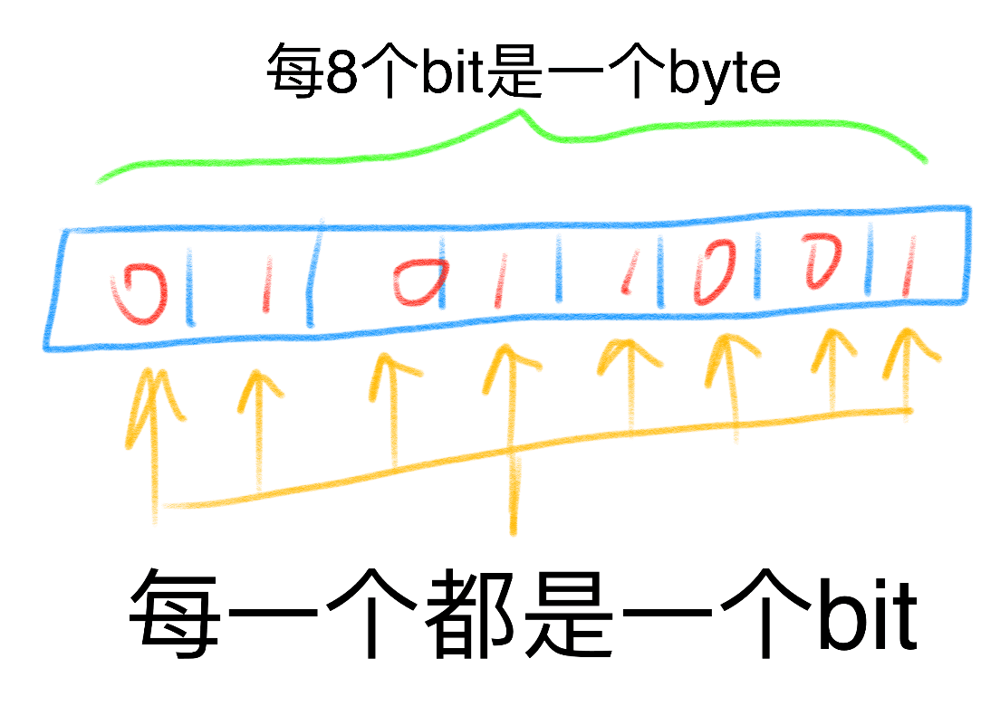
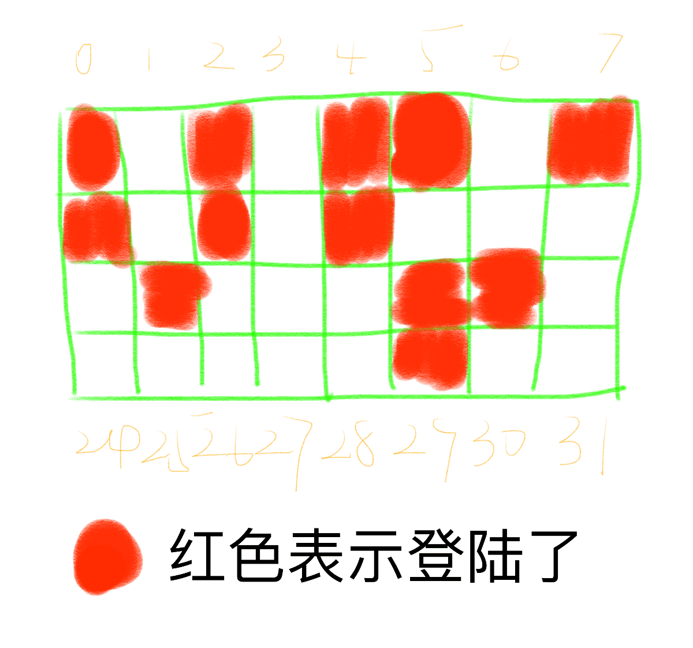
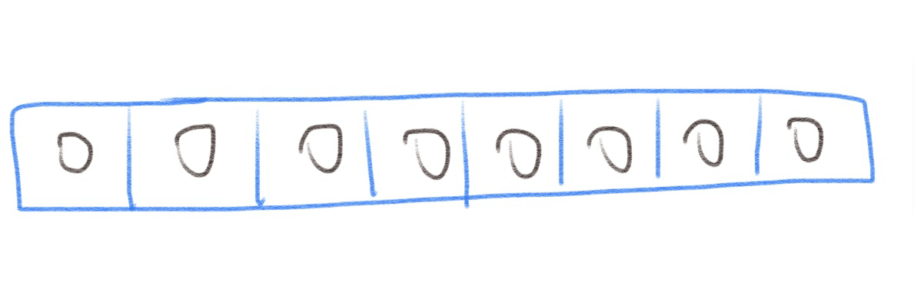
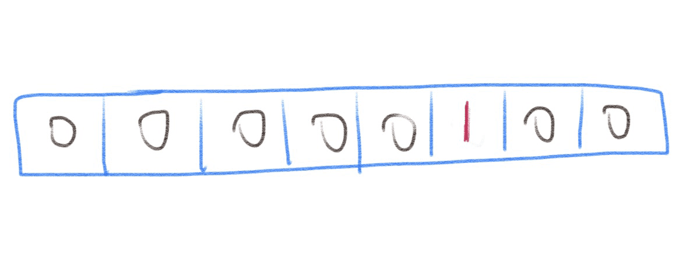

# 位图

bitmap，就是传说中的位图，同样，在常见的互联网业务代码中很少看它的身影，但是在操作系统、网络驱动等软件中无处不是位图的
使用。

## 位图的使用

首先我们来看看什么是位图(bitmap):



我们知道计算机的世界是二进制的世界，最小单位就是bit，一个bit的值只有两个可能，要么是有，也就是1，要么是没有，就是0。而我们
平时所使用的所有类型都是bit构成的，例如我们把8个bit连在一起，称之为一个byte，而int，char，string这些都是在此之上构建的，
位图非常适合用来表示分布上比较连续，状态比较少（只有两种状态）的情况，例如，我们可以使用一个 `uint32` 来表示一个用户在
一个月中的某一天是否登录，如果登录了系统，那么对应天数的那个bit就设置为1，否则就是默认的0，这是因为一个月恰好是连续的
28天或者至多31天：



由图中我们可以看到，登录的天数就是颜色不同的点，而一个 `uint32` 恰好是32个格子，比31天多一点点。

那么我们是怎么对位图进行操作的呢？我们要使用位操作，例如，以一个 byte 为例，默认情况下，他的值是 `00000000`，我们叫他b:



我们要设置第三位bit为1，就这样做：

```
b | (1 << 2)
```

看图：



其原理是，首先计算 `1 << 2`，那么就会得到 `000000100`，然后进行或操作，或操作的规律是，两个操作数中，只要有一个为1，那么
对应的bit都会设置为1，也就是说，只有 `0 | 0 = 0`，其余都等于1。

那如果要取消对应位上的bit呢？就这样做：

```
b & (^(1 << 2))
```

看图：


其原理是，首先同样计算出 `1 << 2 = 0b00000100`，然后进行位取反，得到 `0b11111011`，然后再进行与操作，按位取反的操作是对于
每一个bit，原来是1，就设置成0，原来是0，就设置成1。而与操作则是，只要有一个是0，那么就会设置成0，只有两个都是1的情况，才会
将对应bit设置成1也就是说，只有 `1 & 1 = 1`，其余都等于0。

所以 `11111011` 和 b进行与操作之后，b的第三个bit会被设置成0。

位运算还有很多神奇的用法，都需要仔细去理解才能看到其中的奥妙之处，当然，这也就意味着位操作比较风骚，要多写文档，要不然别人
很难看懂。

## 位图在实际项目中的使用

我们大概多多少少都接触过OAuth2，在使用OAuth2授权的时候，通常应用会弹出一个类似：

```
该程序将获取以下权限：

- 读取你的头像、性别、昵称等基本信息
- 读取你的联系人
- ...
```

如果是我们自己来设计数据库model的时候，我们便可以使用bitmap来存储权限。我们把权限划分成最小粒度之后，每一个bit都它的含义，
例如我们把权限划分为以下几种：

- 获取你的头像、性别、昵称等基本用户信息
- 以你的身份发布微博
- 获取你的好友列表
- 获取你的朋友圈信息

每勾选一个选项，就代表着这个权限被授权，为了保证可扩展性，我们使用一个 `uint64` 来保存这些bit，也就是说，我们一共可以
划分64种细分权限，然后对这些权限进行组合，例如，第一个bit如果设置了，那么就代表可以获取你的头像、性别、昵称等基本用户信息，
第二个bit如果设置了，就可以以你的身份发微博。

```go
package main

import (
	"fmt"
)

const (
	// PermNone 没有权限
	PermNone Permission = iota

	// PermGetUserBaiscInfo 获取你的头像、性别、昵称等基本用户信息
	PermGetUserBaiscInfo Permission = 1 << (iota - 1)
	// PermPostWeibo 以你的身份发布微博
	PermPostWeibo
	// PermGetYourFriends 获取你的好友列表
	PermGetYourFriends
	// PermGetYourTimeline 获取你的朋友圈信息
	PermGetYourTimeline
)

// Permission 权限
type Permission uint64

// AddPermission 设置权限
func AddPermission(perm, toAdd Permission) Permission {
	return perm | toAdd
}

// RemovePermission 移除权限
func RemovePermission(perm, toRemove Permission) Permission {
	return perm & (^toRemove)
}

func main() {
	fmt.Printf("4 basic permissions: %b, %b, %b, %b\n", PermGetUserBaiscInfo, PermPostWeibo, PermGetYourFriends, PermGetYourTimeline)

	p := PermNone
	fmt.Printf("before set perm: %b\n", p)
	p = AddPermission(p, PermGetUserBaiscInfo)
	fmt.Printf("after set perm: %b\n", p)
	p = AddPermission(p, PermGetYourTimeline)
	fmt.Printf("after set perm: %b\n", p)
}
```

执行一下：

```bash
$ go run main.go 
4 basic permissions: 1, 10, 100, 1000
before set perm: 0
after set perm: 1
after set perm: 1001
```

## 总结

在这个篇章里我们看了一下位图的结构和使用，并且结合一个权限的例子看了在实际业务中我们怎么使用bitmap。
