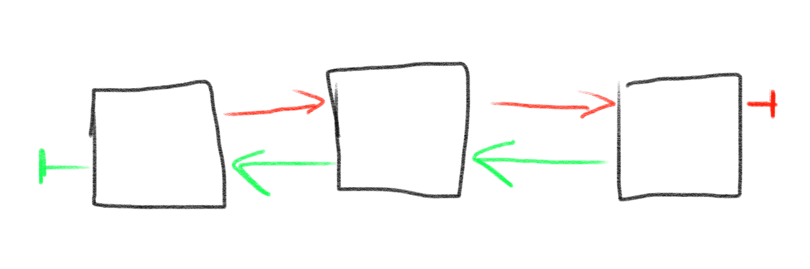
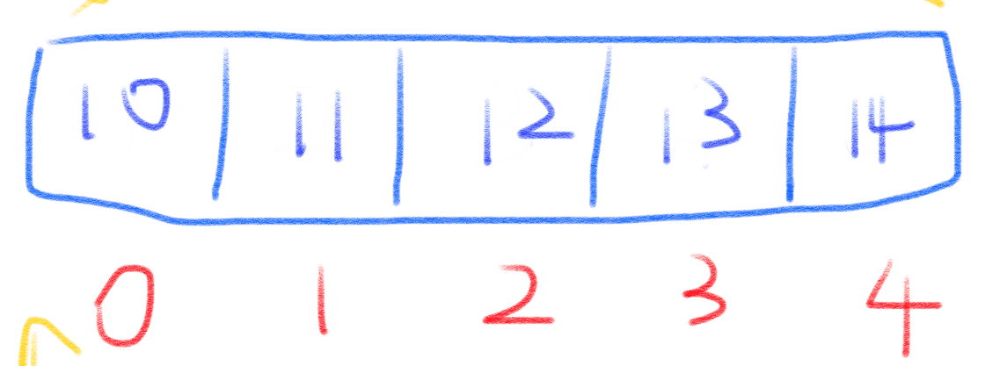
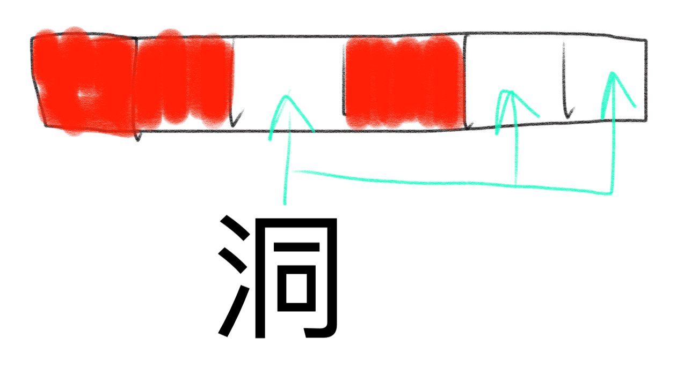
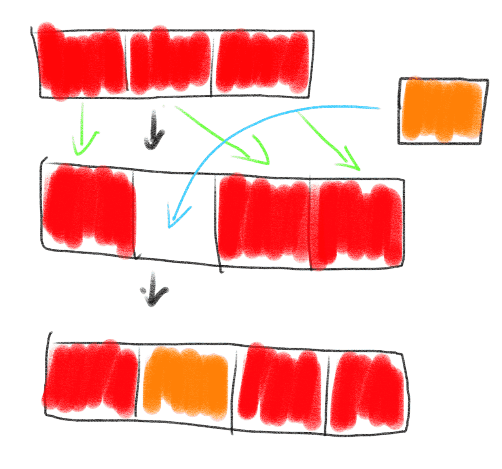
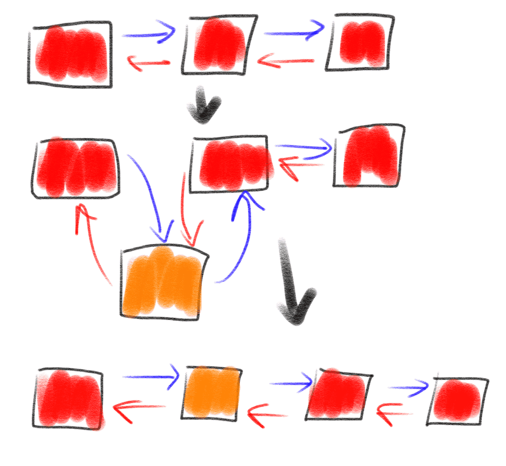
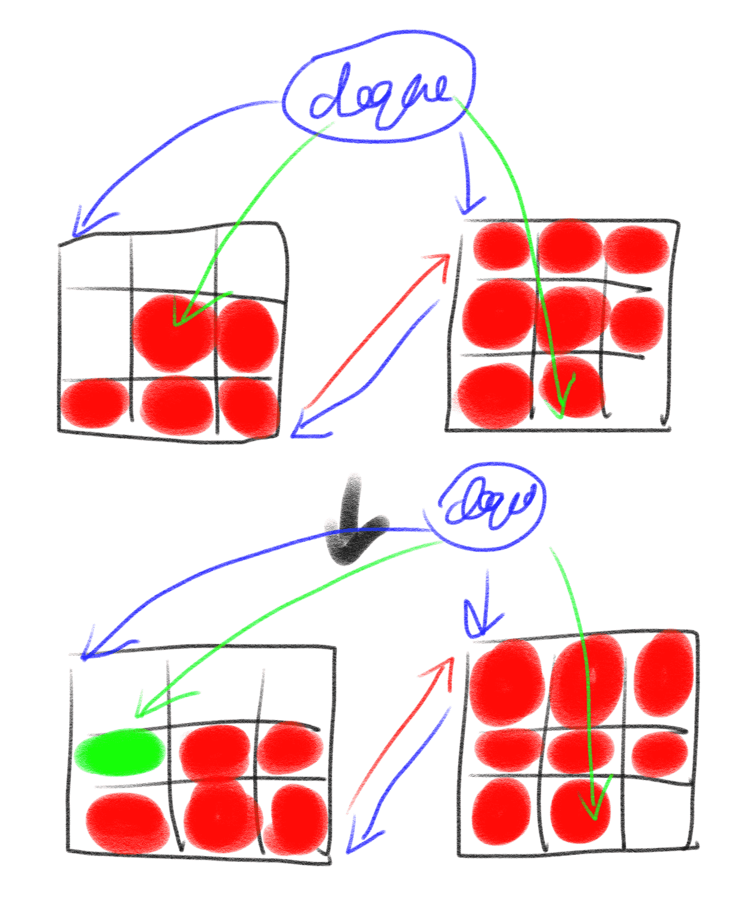

# 链表

链表的实际用途非常广泛，但是一般业务代码不会涉及。一般都在操作系统里，例如文件系统、内存分配；还有哈希表中，
可以用来解决冲突（key冲突时使用链表或者数组来保存）；实现跳跃表等等。

## 链表结构和特征

首先我们来看看链表的结构。链表根据结构通常分为单向链表和双向链表，因为链表中总是有一个地方存储下
一个节点的位置，因此我们抽象来看，它是有方向的。只存储下一个或上一个节点位置的链表，我们称之为单向
链表，既存储上一个节点位置，又存储下一个节点位置的链表，我们称之为双向链表。



## 链表和数组的对比

链表和数组，都是用来存储一批数据的，那么链表和数组有什么不同之处呢？我们回顾一下，数组的结构是这样的：



可以明显的看出来，数组中，每一个元素都是互相挨着的，也就是说，它们是相邻的。当然，数组中的节点也可以
是不相邻的，即中间有很多地方没有填充元素，是一个个的空洞，但是我们一般不会这样用：



原因是特别浪费空间，为了存储1和101，中间有99个元素空间是空着的，而这种场景就特别适合链表，用链表来
表示节点的话，尽管会多了一个（如果是单项链表的话）或两个（如果是双向链表的话）指针的空间，但是仍然
比数组来表示更加节省空间。


也就是说，链表比数组更加适合用来存储不相邻的、零散的数据，而数组更适合用来存储连续的数据。除此之外，
试着想象一下，如果在数组中插入一个元素，我们需要怎么操作？答案是，我们需要先找到位置，然后把该元素
及其后的元素整体往后搬，然后再把该元素写入。



而链表则不是，找到位置之后，新建一个节点，把元素的值存储到该节点，之后更改前后节点的指针的值即可。



链表和数组还有很多的不同，如果有兴趣的话，可以看参考资料中的链表vs数组，而我们在这一节中，只要记住
链表和数组最大的不同之处，就在于链表适合用来存储零散的数据，而数组适合存储连续的数据。

## 链表的使用

Python中的list是链表实现吗？不是。事实上，Python中的list是用数组实现的：

```c
typedef struct {
    PyObject_VAR_HEAD
    /* Vector of pointers to list elements.  list[0] is ob_item[0], etc. */
    PyObject **ob_item;

    /* ob_item contains space for 'allocated' elements.  The number
     * currently in use is ob_size.
     * Invariants:
     *     0 <= ob_size <= allocated
     *     len(list) == ob_size
     *     ob_item == NULL implies ob_size == allocated == 0
     * list.sort() temporarily sets allocated to -1 to detect mutations.
     *
     * Items must normally not be NULL, except during construction when
     * the list is not yet visible outside the function that builds it.
     */
    Py_ssize_t allocated;
} PyListObject;
```

这也就意味着，list的追加性能很高，因为只要在变长数组的最后，追加一个元素即可，但是，如果是在最左侧
插入一个元素呢？根据上一节的描述可以知道，性能非常低，因此我们要把数组原本的n个元素往后搬，然后才
插入（当然，一般实现都会用memmove，但是性能仍然有问题），而Python中如果需要频繁的进行 `lpop`, `lpush`
此类的操作，会推荐使用 `deque`，`deque` 就是用链表实现的。

```c
/* collections module implementation of a deque() datatype
   Written and maintained by Raymond D. Hettinger <python@rcn.com>
*/

/* The block length may be set to any number over 1.  Larger numbers
 * reduce the number of calls to the memory allocator, give faster
 * indexing and rotation, and reduce the link to data overhead ratio.
 * Making the block length a power of two speeds-up the modulo
 * and division calculations in deque_item() and deque_ass_item().
 */

#define BLOCKLEN 64
#define CENTER ((BLOCKLEN - 1) / 2)

/* Data for deque objects is stored in a doubly-linked list of fixed
 * length blocks.  This assures that appends or pops never move any
 * other data elements besides the one being appended or popped.
 *
 * Another advantage is that it completely avoids use of realloc(),
 * resulting in more predictable performance.
 *
 * Textbook implementations of doubly-linked lists store one datum
 * per link, but that gives them a 200% memory overhead (a prev and
 * next link for each datum) and it costs one malloc() call per data
 * element.  By using fixed-length blocks, the link to data ratio is
 * significantly improved and there are proportionally fewer calls
 * to malloc() and free().  The data blocks of consecutive pointers
 * also improve cache locality.
 *
 * The list of blocks is never empty, so d.leftblock and d.rightblock
 * are never equal to NULL.  The list is not circular.
 *
 * A deque d's first element is at d.leftblock[leftindex]
 * and its last element is at d.rightblock[rightindex].
 *
 * Unlike Python slice indices, these indices are inclusive on both
 * ends.  This makes the algorithms for left and right operations
 * more symmetrical and it simplifies the design.
 *
 * The indices, d.leftindex and d.rightindex are always in the range:
 *     0 <= index < BLOCKLEN
 *
 * And their exact relationship is:
 *     (d.leftindex + d.len - 1) % BLOCKLEN == d.rightindex
 *
 * Whenever d.leftblock == d.rightblock, then:
 *     d.leftindex + d.len - 1 == d.rightindex
 *
 * However, when d.leftblock != d.rightblock, the d.leftindex and
 * d.rightindex become indices into distinct blocks and either may
 * be larger than the other.
 *
 * Empty deques have:
 *     d.len == 0
 *     d.leftblock == d.rightblock
 *     d.leftindex == CENTER + 1
 *     d.rightindex == CENTER
 *
 * Checking for d.len == 0 is the intended way to see whether d is empty.
 */

typedef struct BLOCK {
    struct BLOCK *leftlink;
    PyObject *data[BLOCKLEN];
    struct BLOCK *rightlink;
} block;

typedef struct {
    PyObject_VAR_HEAD
    block *leftblock;
    block *rightblock;
    Py_ssize_t leftindex;       /* 0 <= leftindex < BLOCKLEN */
    Py_ssize_t rightindex;      /* 0 <= rightindex < BLOCKLEN */
    size_t state;               /* incremented whenever the indices move */
    Py_ssize_t maxlen;          /* maxlen is -1 for unbounded deques */
    PyObject *weakreflist;
} dequeobject;
```

可以看出来，`deque` 是一个双链表，如注释所说，`deque` 的实现是用链表把多个block串起来。经典的教科书式实现是一个元素
一个节点，这样有一个缺点就是双链表存储前后节点所用的空间占比过高，`deque` 把数据存在一个block里，然后用链表把block
串起来。这样，当需要从左侧或者右侧插入或者弹出一个数据的时候，就可以快速的实现：



## 总结

这一篇中我们先从链表的结构看起，随后对比了链表和数组的区别，分别适用何种场景，最后我们
描述了链表在实际项目中的使用，除了我们所说的例子(`deque`)，实际项目中还有很多使用链表的
地方，例如Linux内核中就有很多地方使用，我们只是采取了一个简单而又具体的例子来看链表在实际项目中的使用。

---

参考资料：

- [链表vs数组(英文)](https://www.geeksforgeeks.org/linked-list-vs-array/)
