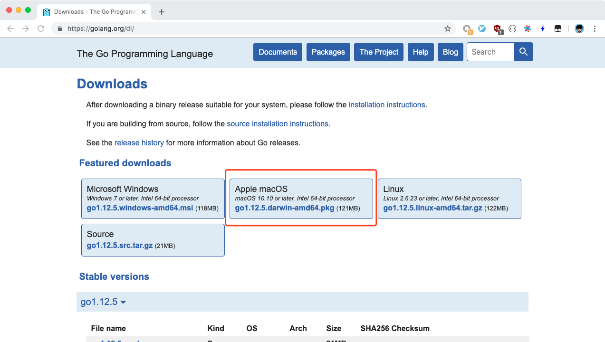
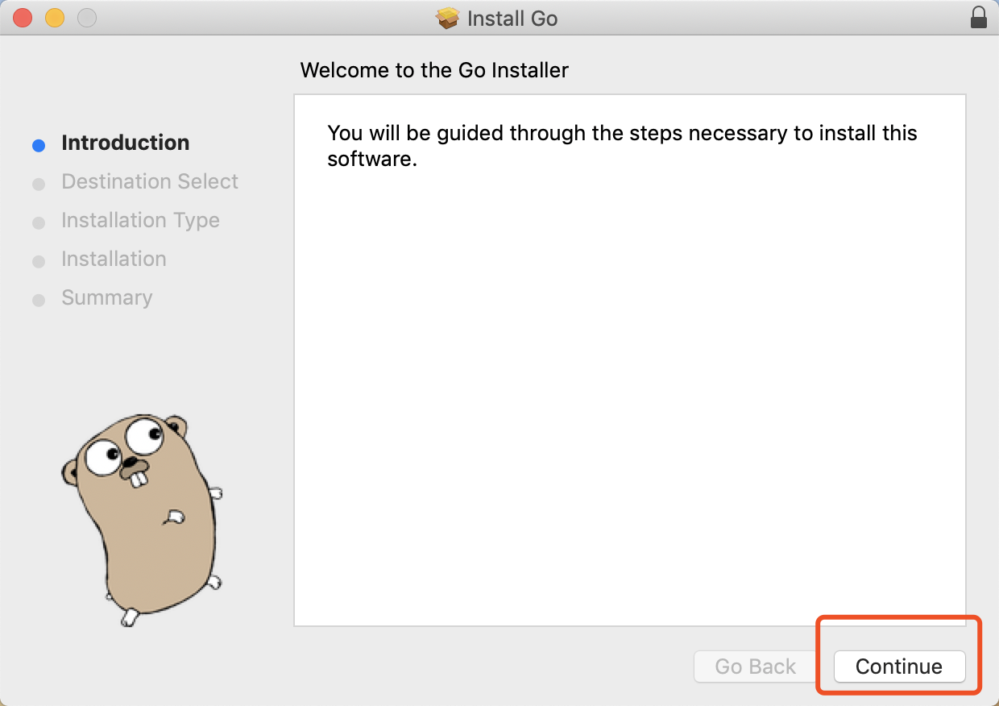
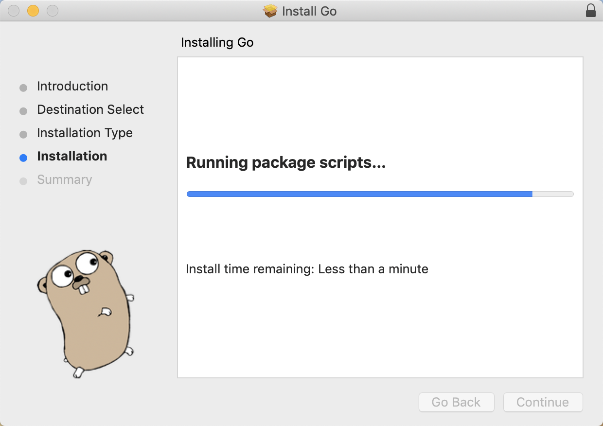
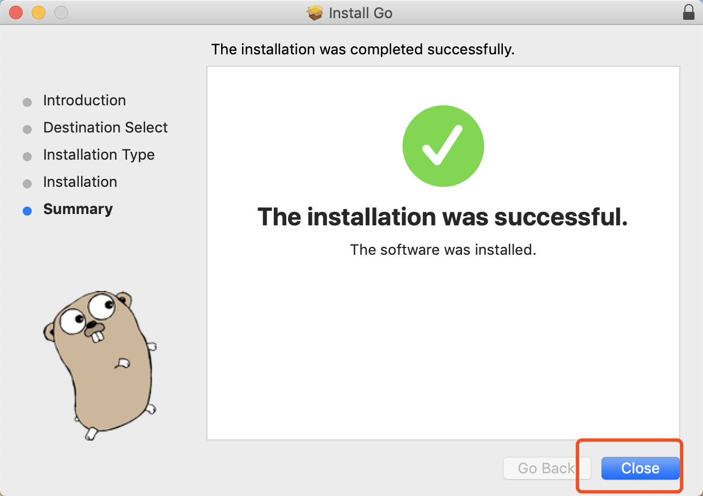

# macOS上安装Golang

## 目录

- [安装](./installation_linux.md)
    - [Windows](./installation_windows.md)
    - [Linux](./installation_linux.md)
    - [macOS](./installation_mac_os.md)
- [Hello, World](./hello_world.md)
- [Go语言简介](./intro.md)
- [基本类型](./basic_types.md)
- [容器类型](./composite_types.md)
- [函数](./function.md)
- [流程控制](./flow.md)
- [错误处理](./errors.md)
- [面向对象编程](./oo.md)
- [面向接口编程](./interface.md)
- [指针](./pointers.md)
- [Goroutine](./goroutine.md)
- [Channel](./channel.md)
- [并发编程](./concurrency.md)
- [go tools](./go_tool.md)

> 首先需要学会使用 [终端](https://zh.wikihow.com/%E5%9C%A8Mac%E7%94%B5%E8%84%91%E4%B8%8A%E6%89%93%E5%BC%80%E7%BB%88%E7%AB%AF)

如果你是 `homebrew` 的用户，那么很简单，在终端中输入下面一行即可安装：

> 了解如何 [如何使用homebrew](https://brew.sh/index_zh-cn)

```bash
$ brew install go
```

> 请注意，$ 和 # 都是命令行的提示符，$ 代表你是普通账号，# 代表你是root(管理员)账号，下同。

至此，就可以跳到下一节。 如果不是 `homebrew` 的用户，那么请继续阅读。

- 首先我们需要打开[Go语言的官网下载地址](https://golang.org/dl/)，点击红框处进行下载：

    

- 下载完成之后，双击安装包，会有弹窗，我们一路点下一步：

    
    
    
    

- 安装完成之后，go会被安装到 `/usr/local/go` 这个路径下：

```bash
$ ls /usr/local/go/
AUTHORS  CONTRIBUTING.md  CONTRIBUTORS  LICENSE  PATENTS  README.md  VERSION  api  bin  doc  favicon.ico  lib  misc  pkg  robots.txt  src  test
```

我们需要手动把这个路径添加到 `PATH` 环境变量里，使用编辑器编辑 `~/.bashrc`，在最后面加一行：

```bash
export PATH=/usr/local/go/bin:$PATH
```

将终端关闭，重新打开，我们输入以下命令进行确认：

```bash
$ go version
go version go1.12.5 darwin/amd64
$ which go
/usr/local/go/bin/go
```

如果看到上面的输出，那么证明Go已经安装好了。

---

- 上一篇：这是第一篇
- 下一篇：[Hello, World](./hello_world.md)
