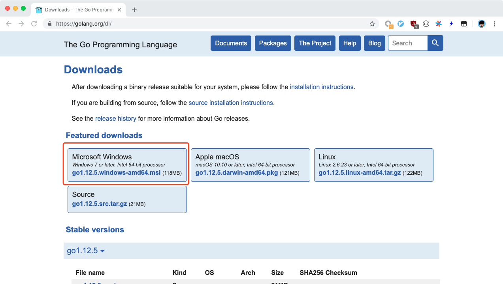
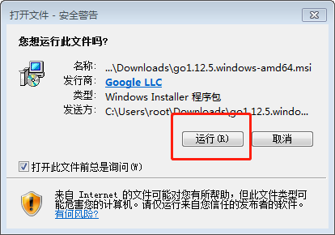
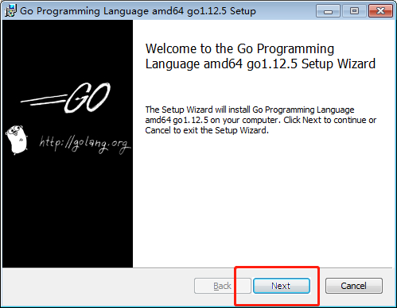
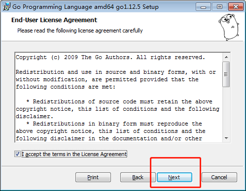
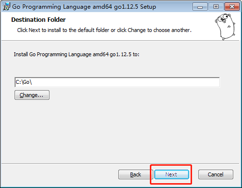
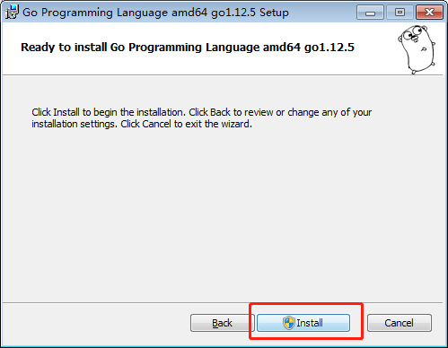
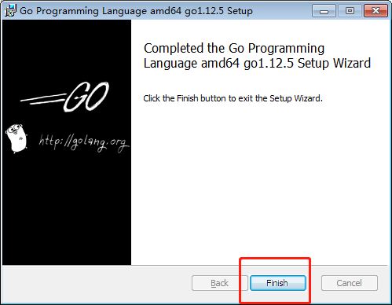
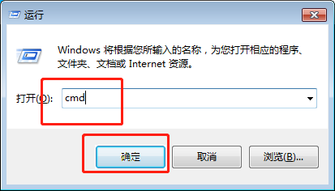
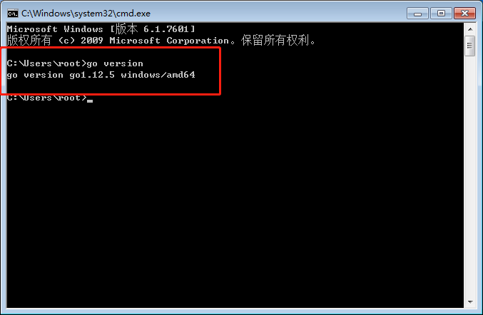

# Windows上安装Golang

## 目录

- [安装](./installation_linux.md)
    - [Windows](./installation_windows.md)
    - [Linux](./installation_linux.md)
    - [macOS](./installation_mac_os.md)
- [Hello, World](./hello_world.md)
- [Go语言简介](./intro.md)
- [基本类型](./basic_types.md)
- [容器类型](./composite_types.md)
- [函数](./function.md)
- [流程控制](./flow.md)
- [错误处理](./errors.md)
- [面向对象编程](./oo.md)
- [面向接口编程](./interface.md)
- [指针](./pointers.md)
- [Goroutine](./goroutine.md)
- [Channel](./channel.md)
- [并发编程](./concurrency.md)
- [go tools](./go_tool.md)

首先我们需要打开[Go语言的官网下载地址](https://golang.org/dl/)，点击红框处进行下载：

    

- 下载完成之后，双击安装包，会有弹窗，我们一路点下一步：

    
    
    
    
    
    

- 至此我们就安装完成了，接下来我们按 `Win + r`，然后输入 `cmd`，并且按下回车，之后输入 `go version` 并且回车来进行校验，
如果有如下输出，那么说明安装成功：

    
    

---

- 上一篇：这是第一篇
- 下一篇：[Hello, World](./hello_world.md)
