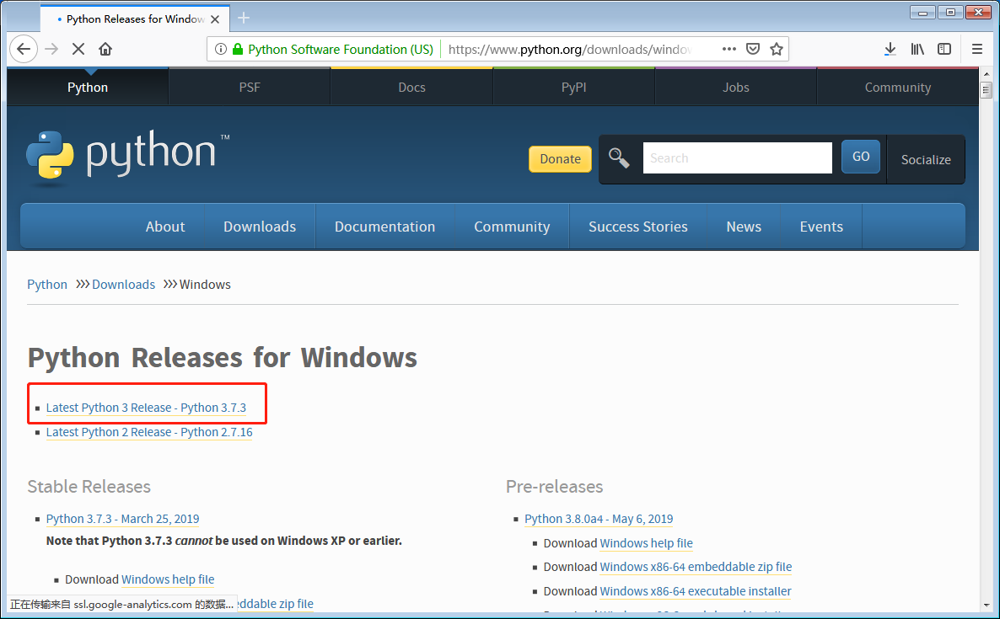
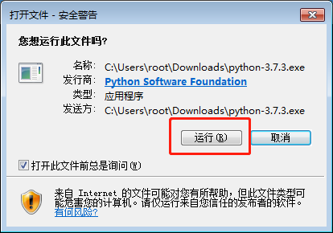
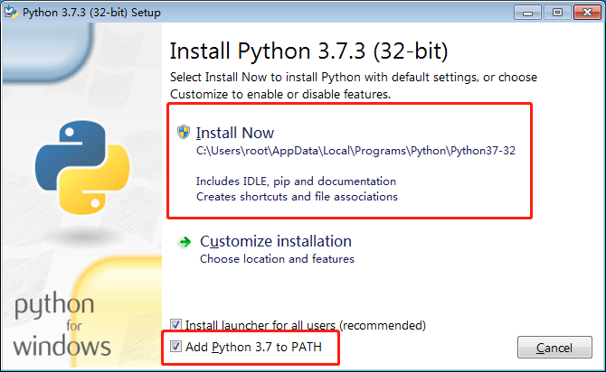
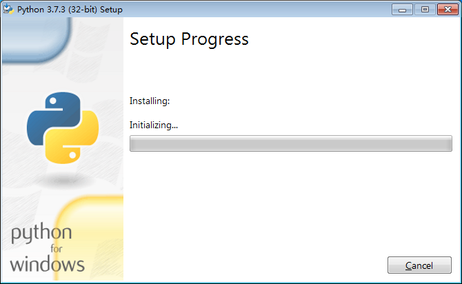
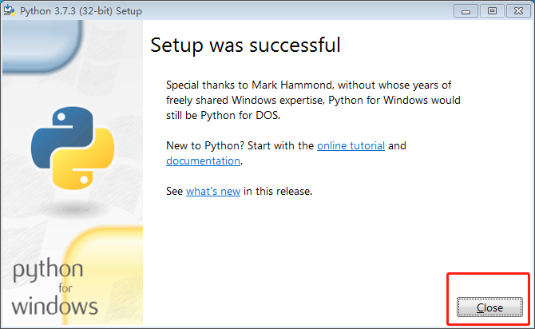
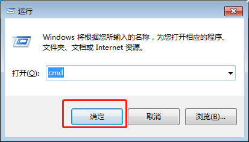

# macOS安装Python

## 目录

- 安装
    - [Linux](./linux.md)
    - [Windows](./windows.md)
    - [macOS](./macos.md)
- [Hello World!](./hello_world.md)
- [基本类型](./basic_types.md)
- [容器类型](./composite_types.md)
- [控制流](./flow.md)
- [函数](./function.md)
- [面向对象编程](./oo.md)
- [面向接口编程](./interface.md)
- [模块和包](./module_and_package.md)
- [异常处理](./exception.md)

首先你需要打开 [Python的官网进行下载](https://www.python.org/downloads/windows/)，点击 `Latest Python 3 Release - Python 3.7.3` 进行下载：


下载完成之后一路下一步，注意其中有一节需要点击 `Add Python To PATH`，把它勾上。








在cmd窗口输入 `python --version` 如果打印出了Python的版本是 `3.x` 那么就是ok的！

```bash
$ python --version
Python 3.6.0
```


---

- 上一篇：这是第一篇
- 下一篇：[基本类型](./basic_types.md)
